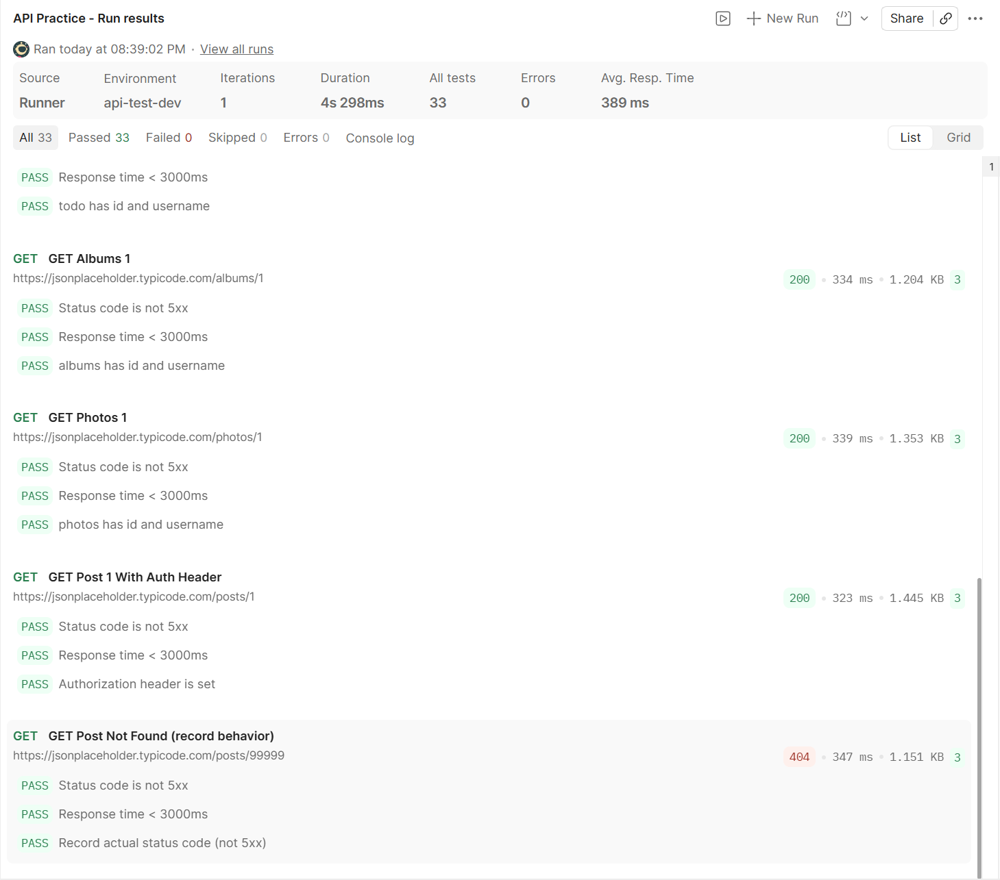

# api-test-framework

## Quick start

```bash
python -m venv .venv
# Windows: .venv\Scripts\Activate.ps1
# macOS/Linux: source .venv/bin/activate
pip install -r requirements.txt
pytest -q
```

## Postman Collection (Day3)

- Import: `docs/postman/postman_collection_day3.json`
- Import env: `docs/postman/postman_environment_dev.json`
- Select env: `api-test-dev`
- Run: Collection Runner → verify all assertions pass



## Day4 - Migrate Postman Collection to Pytest (Data-driven)

This project migrates a Postman collection (10+ requests) into a pytest-based API automation suite.

### What’s included

- Data-driven test cases (`data/postman_migrated_cases.json`)
- Reusable HTTP client (`core/http_client.py`)
- Environment-based configuration (`config/env.py`)
- One-command run: `python -m pytest -q`

### Run (Windows PowerShell)

```powershell
# optional: override environment variables
$env:BASE_URL="https://jsonplaceholder.typicode.com"
$env:TOKEN="fake_token_123"
$env:TIMEOUT="10"

python -m pytest -q
```

## Day5 - SQL Validation (API vs DB)

- Skills: SELECT / JOIN / GROUP BY / HAVING
- Output: `docs/sql_validation_cases.md` (10 cases + SQL)
- Demo DB: `reports/demo.db` (SQLite)

### Run

```powershell
python tools/seed_sqlite_from_api.py
```

## Day 6 - Linux 排障最小集合（Troubleshooting Minimal Set）

**目标**：能用固定流程定位接口异常/慢：`curl 复现 → 端口/进程 → 日志 → 结论/修复 → 回归验证`  
**交付物**：`docs/debug_sop.md`（排障 SOP）

### 1) 必会命令（Minimal Commands）

- 复现与耗时（Reproduce & Measure）
  - `curl -i <url>`
  - `curl -v <url>`
  - `curl -s -o /dev/null -w "%{http_code} %{time_total}\n" <url>`
- 端口/进程（Port & Process）
  - `ss -lntp | head -n 50`
  - `ss -lntp | grep ':<port> '`
  - `sudo lsof -i :<port> | head`
  - `ps -p <pid> -o pid,user,cmd --no-headers`
  - `systemctl status <service> --no-pager -n 60`
- 日志（Logs）
  - `sudo journalctl -u <service> -n 120 --no-pager`
  - `sudo journalctl -u <service> --since "today" --no-pager | grep -nEi "error|warn|tls|handshake" | tail -n 120`

### 2) 练习 Case（本日覆盖）

#### Case A：Reverse Proxy 502（上游未监听）

- **特征**：网关日志出现 `connect: connection refused` / `dial tcp ... refused`
- **验证**：
  - `ss -lntp | grep ':8000 ' || echo "8000 not listening"`
  - `curl -s -o /dev/null -w "%{http_code} %{time_total}\n" http://127.0.0.1:8000/ || true`
- **修复（systemd）**：
  - `sudo systemctl daemon-reload`
  - `sudo systemctl enable --now <service>`
  - `sudo journalctl -u <service> -n 120 --no-pager`（失败时查原因）
- **回归**：
  - `ss -lntp | grep ':8000 '`
  - `curl -s -o /dev/null -w "%{http_code} %{time_total}\n" https://api.<domain>/ || true`

#### Case B：本机 curl https 失败（TLS SNI / Host 误区）

- **现象**：`curl https://127.0.0.1` / `https://localhost` 报 `TLS alert internal error`
- **关键点**：`-H "Host: ..."` **不会改变 TLS SNI**
- **正确本机验证（推荐）**：
  - `curl -Iv --resolve www.<domain>:443:127.0.0.1 https://www.<domain>/`
  - `curl -Iv --resolve api.<domain>:443:127.0.0.1 https://api.<domain>/`
- **可选修复**：需要本地也能 `https://localhost` 时，在 Caddyfile 增加 `localhost, 127.0.0.1 { tls internal ... }`

### 3) 成果

- 形成结构化排障 SOP：`docs/debug_sop.md`
- 能用证据链解释：
  - 502：upstream down / port not listening
  - TLS：SNI 与 Host header 区别，`--resolve` 模拟真实域名

## Week1 Summary – API Testing Fundamentals

### 本周目标

完成接口测试基础能力建设，包括：

- API 测试方法
- Postman 断言
- SQL 数据验证
- Linux 排障基础
- 测试思维总结

## Day8

实现 pytest + requests 接口自动化

功能：

- pytest 参数化
- requests 调用 API
- status code 断言
- JSON字段断言

当前用例数量：

10+

## Day9：封装 API Client（Requests Session）

### 目标

将用例中的 `requests.get/post` 统一封装为 `client.get/post`，做到：

- `base_url` 统一管理
- 复用 `requests.Session()`（连接复用/性能更好）
- 用例更短、更易维护（更接近企业项目写法）

### 本日改动

新增模块：

- `config/config.py`：集中管理 `BASE_URL`、默认超时等配置
- `core/client.py`：封装 `APIClient`，提供 `request/get/post` 方法

用例改造：

- `tests/test_posts.py` 从 `requests.get(url)` 改为 `client.get(path)`

### 目录结构

```text
api-test-framework
├─ tests/
│  └─ test_posts.py
├─ core/
│  └─ client.py
├─ config/
│  └─ config.py
├─ data/
├─ reports/
└─ requirements.txt
```

## Day10：断言层（Assertion Layer）

### 目标

将测试用例中的“裸断言”抽象为统一的断言工具（Assertion Helpers），让用例更短、更一致、更易维护，并且在失败时输出更可读的错误信息（包含 `url/status/body/json` 等关键上下文）。

### 本日改动

新增模块：

- `core/assertions.py`
  - `assert_status(resp, expected)`：状态码断言（失败时打印 url/status/body）
  - `assert_status_in(resp, {..})`：状态码集合断言（适用于 200/404 等多分支预期）
  - `assert_json_has_keys(resp, keys)`：JSON 必要字段存在断言
  - `assert_json_value(resp, key, expected)`：JSON 字段值断言
  - `assert_json_path_value(resp, "a.b.c", expected)`：嵌套字段 JSON Path 断言（可选）
  - 内部工具：`_safe_json/_safe_text`（JSON 解析失败也能输出可读信息）

用例改造：

- `tests/test_posts.py`
  - 将 `assert r.status_code == ...`、`r.json()["xx"] == ...` 替换为断言层函数
  - 删除不再使用的 `requests` import
  - 对不确定返回（如 200/404）使用 `assert_status_in`

### 目录结构

```text
api-test-framework
├─ tests/
│  └─ test_posts.py
├─ core/
│  ├─ client.py
│  └─ assertions.py
├─ config/
│  └─ config.py
├─ data/
├─ reports/
└─ requirements.txt
```

